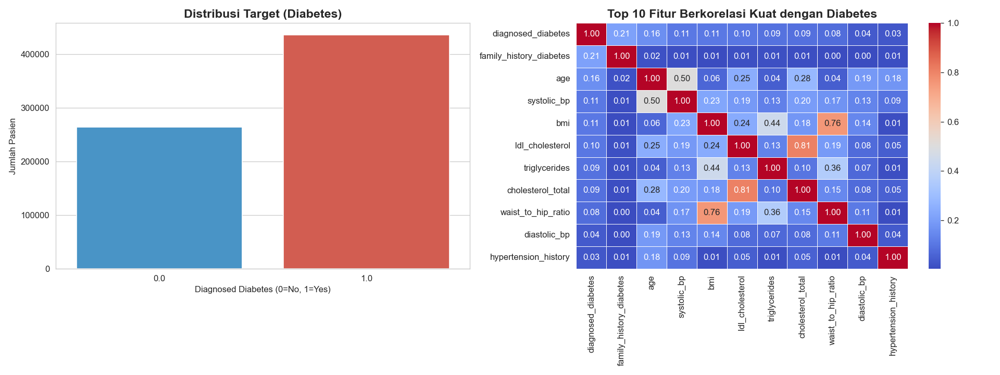
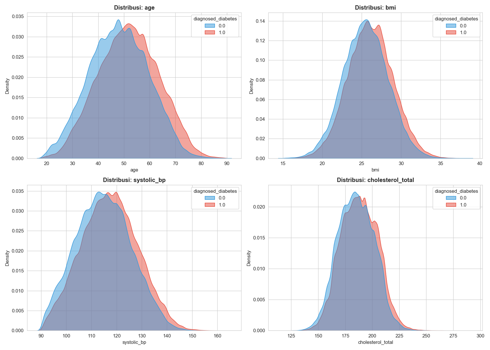
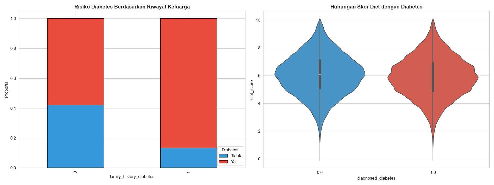
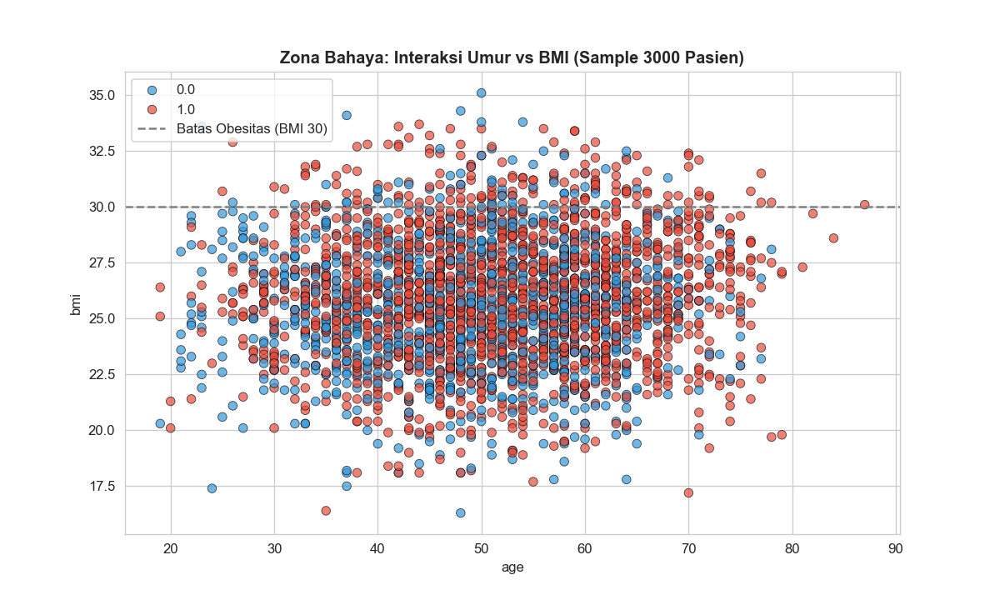
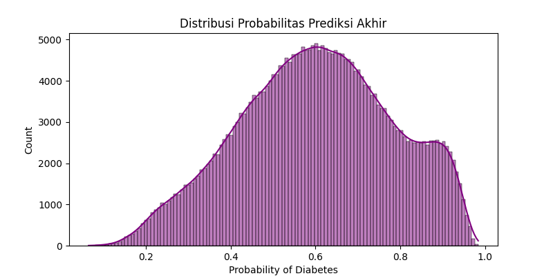
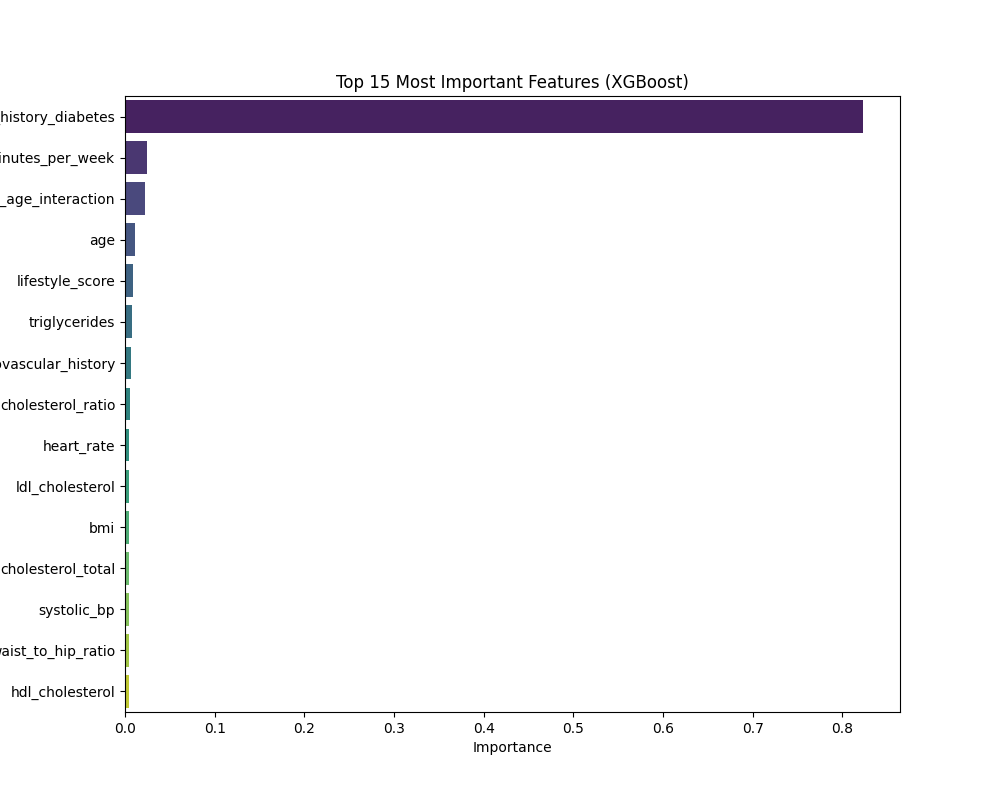

# Diabetes Prediction - Kaggle Playground S5E12


## Overview
Repository ini berisi solusi *End-to-End Machine Learning* untuk kompetisi **Kaggle Playground Series S5E12: Diabetes Prediction**. Tujuan utama project ini adalah memprediksi probabilitas seorang pasien didiagnosis diabetes berdasarkan data kesehatan dan demografi.

Solusi ini dibangun dengan fokus pada **Reproducibility** (mudah dijalankan ulang) dan **High Accuracy** menggunakan teknik Ensemble Learning.

**Target Metric:** ROC AUC

## Key Strategy
Untuk mencapai akurasi tinggi, pendekatan berikut diterapkan:

1.  **Medical Feature Engineering:**
    * Menambahkan fitur medis seperti *Pulse Pressure*, *Mean Arterial Pressure (MAP)*, dan *Cholesterol Ratio*.
    * Interaksi fitur gaya hidup (Diet, Aktivitas Fisik, Alkohol).
2.  **Robust Preprocessing:**
    * Menggunakan `OrdinalEncoder` untuk data kategorikal.
    * `RobustScaler` untuk menangani outlier pada data numerik.
3.  **Model Ensemble (Stacking/Blending):**
    * Menggabungkan 3 model kuat: **XGBoost**, **HistGradientBoosting**, dan **Random Forest**.
    * Pembobotan (Weighted Average) berdasarkan performa Cross-Validation.
4.  **Hyperparameter Tuning:**
    * Menggunakan **Optuna** untuk mencari parameter optimal secara otomatis.

## Project Structure
Struktur direktori disusun menggunakan prinsip *Cookiecutter Data Science* yang disederhanakan:

```text
diabetes-prediction/
│
├── data/                    # Dataset (Train/Test csv) - Diabaikan oleh git
├── models/                  # Model .pkl yang sudah dilatih (disimpan otomatis)
├── notebooks/               # Jupyter Notebooks untuk eksperimen
│   ├── eda.ipynb            # Analisis Data Eksploratif (EDA)
│   └── modeling.ipynb       # Eksperimen Model & Optuna Tuning
│
├── outputs/                 # Hasil prediksi (submission.csv)
├── src/                     # Source Code untuk Produksi
│   ├── extract.py           # Script Extract Data dari Kaggle
│   ├── config.py            # Konfigurasi & Hyperparameters
│   ├── preprocessing.py     # Class Feature Engineering
│   ├── train.py             # Script Training Pipeline
│   └── inference.py         # Script Prediksi Pipeline
│
├── requirements.txt         # Daftar library
└── README.md                # Dokumentasi Project
```

## Installation
1. Clone repository ini:

```Bash
git clone [https://github.com/fikrifaizz/diabetes-prediction.git](https://github.com/fikrifaizz/diabetes-prediction.git)
cd diabetes-prediction
```

2. Install dependencies: Disarankan menggunakan Virtual Environment.

```Bash
pip install -r requirements.txt
```

3. Setup Data: Letakkan file train.csv dan test.csv dari Kaggle ke dalam folder data/.

## Usage (Cara Menjalankan)
Project ini dirancang modular. Anda tidak perlu membuka Notebook untuk melatih model ulang.

1. Training Model (Retrain) 

    Jalankan perintah ini untuk melatih model menggunakan parameter terbaik (yang tersimpan di src/config.py) pada 100% data training:

    ```Bash
    python -m src.train
    ```

    Output: Model .pkl akan disimpan di folder models/.


2. Inference (Membuat Prediksi)

    Jalankan perintah ini untuk memprediksi data test dan membuat file submission:

    ```Bash
    python -m src.inference
    ```

    Output: File submission_final.csv akan muncul di folder outputs/.

## Results & Performance
| Model | CV Score (AUC) | Weight in Ensemble |
| --- | --- | --- |
| XGBoost | 0.726 | 0.50 |
| HistGradientBoosting | 0.724 | 0.35 |
| Random Forest | 0.701 | 0.15 |


## Visualizations
Berikut adalah hasil analisis korelasi fitur terhadap target Diabetes:














